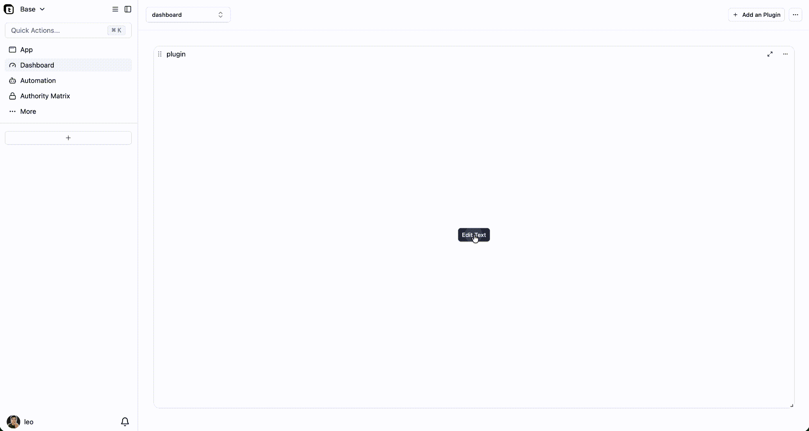
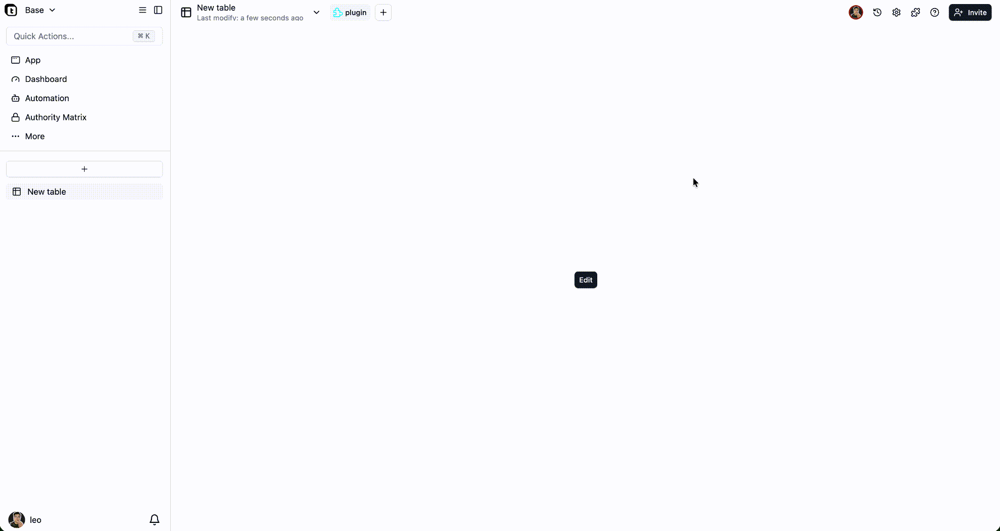

# Teable Text Plugin

This project is a Text plugin based on [Next.js](https://nextjs.org) and [Teable](https://teable.ai), designed for displaying and managing text content within Teable, supporting complete Markdown editing and viewing functionality.

## Features
- 📝 Text viewing and editing functionality
- ⚡️ Integrated Teable plugin development environment
- 🌈 Multi-theme support (light/dark)
- 🌍 Internationalization (i18n) support (English/Chinese)
- 🪄 Easy to extend and customize
- 💾 Text storage with configurable API
- 📏 内容长度验证 (最大128KB)
- 🎯 水平对齐控制 (左对齐/居中/右对齐)

#### 🔌 View, Dashboard, Panel Three Plugin Modes
*Shows the different user experience of view, dashboard, and panel plugin modes*



## Dependencies
- [Next.js](https://nextjs.org)
- [@teable/core](https://www.npmjs.com/package/@teable/core)
- [@teable/sdk](https://www.npmjs.com/package/@teable/sdk)
- [@teable/openapi](https://www.npmjs.com/package/@teable/openapi)
- [@teable/ui-lib](https://www.npmjs.com/package/@teable/ui-lib)
- [@teable/next-themes](https://www.npmjs.com/package/@teable/next-themes)
- [@tanstack/react-query](https://tanstack.com/query/latest)

## ⚠️ Configuration Required

Before using this plugin, you have to modify the baseURL in `src/hooks/useTextStorage.ts` to your self host server address.

For example:
```typescript
config.baseURL = 'https://your-api-server.com/api';
```

## Getting Started

### 1. Install dependencies
```bash
npm install
```

### 2. Configure baseURL (Required)
See the configuration section above before proceeding.

### 3. Start the development server
```bash
npm run dev
```
Visit [http://localhost:3000](http://localhost:3000) to view the app.

### 4. Build for production
```bash
npm run build
```

### 5. Start in production mode
```bash
npm start
```

## Project Structure
- `src/app/page.tsx`: App entry, integrates i18n, environment, theme, etc.
- `src/app/Main.tsx`: Main business entry, integrates Teable SDK, theme, QueryClient
- `src/components/TextViewer.tsx`: Main text viewing component
- `src/components/TextConfig.tsx`: Text configuration component
- `src/components/TextPages.tsx`: Text pages management
- `src/hooks/useTextStorage.ts`: Text storage hook with API configuration ⚠️ **Requires baseURL configuration**
- `src/utils/storageApi.ts`: Storage API utilities
- `src/components/context/EnvProvider.tsx`: Injects environment variables
- `src/components/context/I18nProvider.tsx`: Internationalization support
- `src/components/context/TextProvider.tsx`: Text context provider

## Environment Variables & Plugin Parameters
The `EnvProvider` component automatically reads plugin parameters (such as `lang`, `baseId`, `pluginId`, etc.) from the URL, no manual configuration required.

## API Integration
This plugin requires an external API server for text storage and retrieval. Make sure your API server:
1. Is accessible from the configured baseURL
2. Supports the required endpoints for text operations
3. Handles CORS properly if hosted on a different domain

## 开发说明
- The plugin uses React Query for data fetching and caching
- All text operations are handled through the storage API
- The UI is responsive and supports both light and dark themes
- Internationalization is supported with English and Chinese translations
- Content length is limited to 128KB (131,072 characters) for performance
- Real-time character count and validation feedback
- Horizontal alignment applies to text, images, and lists in markdown content

插件使用 React Query 进行数据获取和缓存
所有文本操作通过存储 API 处理
UI 响应式设计，支持明暗主题
支持中英文国际化
内容长度限制为 128KB (131,072 字符) 以保证性能
实时字符计数和验证反馈
水平对齐适用于 markdown 内容中的文本、图片和列表

